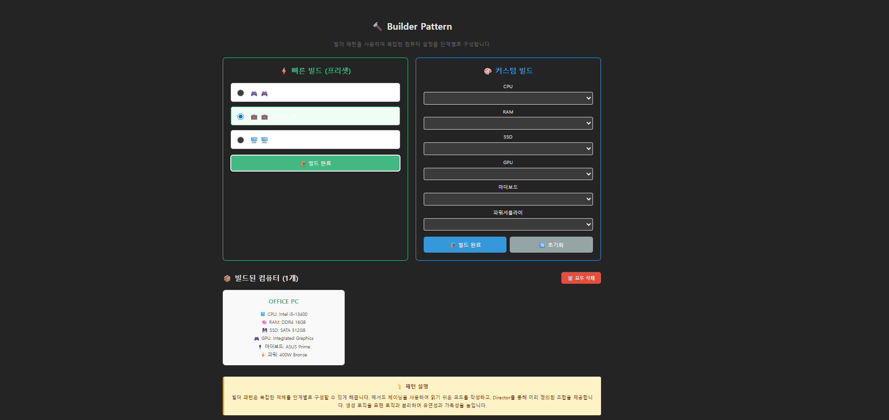
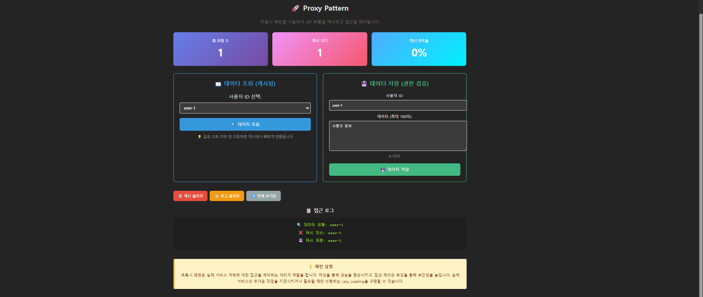
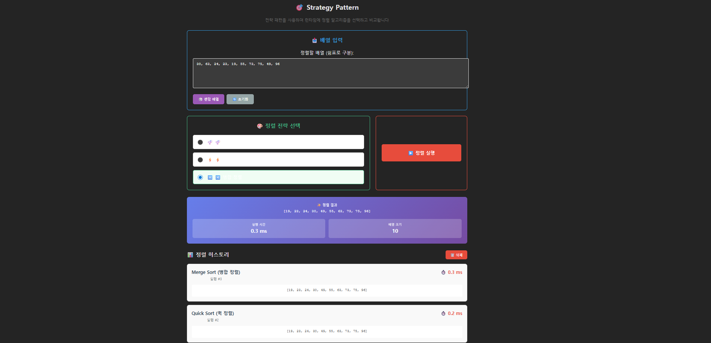

# Design Patterns 🎯

Vue 3 + TypeScript + Vite를 사용하여 구현한 **9가지 디자인 패턴** 데모 프로젝트입니다.

## 🚀 기술 스택

- **Framework**: Vue 3 (Composition API with `<script setup>`)
- **Language**: TypeScript
- **Build Tool**: Vite
- **Styling**: Inline CSS + Scoped Styles

## 📚 구현된 패턴 (9가지)

### 생성 패턴 (Creational Patterns)

| # | 패턴 | 설명 | 파일 |
|---|------|------|------|
| 1 | **Singleton** | 클래스의 인스턴스를 하나만 생성 | `Singleton.ts` / `SingletonDemo.vue` |
| 2 | **Factory Method** | 객체 생성을 서브클래스에 위임 | `FactoryMethod.ts` / `FactoryMethodDemo.vue` |
| 3 | **Builder** | 복잡한 객체를 단계별로 구성 | `Builder.ts` / `BuilderDemo.vue` |

### 구조 패턴 (Structural Patterns)

| # | 패턴 | 설명 | 파일 |
|---|------|------|------|
| 4 | **Adapter** | 호환되지 않는 인터페이스를 연결 | `Adapter.ts` / `AdapterDemo.vue` |
| 5 | **Decorator** | 객체에 동적으로 기능 추가 | `Decorator.ts` / `DecoratorDemo.vue` |
| 6 | **Proxy** | 객체에 대한 접근을 제어 | `Proxy.ts` / `ProxyDemo.vue` |

### 행위 패턴 (Behavioral Patterns)

| # | 패턴 | 설명 | 파일 |
|---|------|------|------|
| 7 | **Observer** | 상태 변화를 자동으로 알림 | `Observer.ts` / `ObserverDemo.vue` |
| 8 | **Visitor** | 객체 구조와 연산을 분리 | `Visitor.ts` / `VisitorDemo.vue` |
| 9 | **Strategy** | 런타임에 알고리즘 선택 | `Strategy.ts` / `StrategyDemo.vue` |

## 🎮 각 패턴 설명

### 1️⃣ Singleton Pattern
- **목적**: 클래스의 인스턴스를 하나만 유지
- **사용 예**: 데이터베이스 연결, 설정 관리자, 로거
- **기능**: 인스턴스 카운트 추적

### 2️⃣ Factory Method Pattern
- **목적**: 객체 생성 로직을 캡슐화
- **사용 예**: UI 컴포넌트 생성, 데이터 포맷 변환기
- **기능**: 여러 유형의 제품 생성

### 3️⃣ Builder Pattern
- **목적**: 복잡한 객체를 단계별로 구성
- **사용 예**: 컴퓨터 구성, 프로필 설정
- **기능**: 메서드 체이닝, 미리 정의된 조합(Director)
  
  *빌더 패턴 데모: 프리셋 빌드와 커스텀 빌드를 통한 컴퓨터 구성*

### 4️⃣ Adapter Pattern
- **목적**: 호환되지 않는 인터페이스를 연결
- **사용 예**: 결제 시스템 통합, API 래퍼
- **기능**: 기존 코드 수정 없이 새로운 인터페이스 추가

### 5️⃣ Decorator Pattern
- **목적**: 객체에 동적으로 새로운 기능 추가
- **사용 예**: 알림 채널(이메일, SMS, Slack), 스트림 처리
- **기능**: 런타임에 기능 조합

### 6️⃣ Proxy Pattern
- **목적**: 객체에 대한 접근을 제어
- **사용 예**: API 캐싱, 접근 제어, 로깅
- **기능**: 캐시 메커니즘, 권한 검증, 요청 통계
  
  *프록시 패턴 데모: 캐시 히트율 및 데이터 조회/저장 기능*

### 7️⃣ Observer Pattern
- **목적**: 상태 변화를 자동으로 알림
- **사용 예**: 주식 시세 업데이트, 이벤트 시스템
- **기능**: 관찰자 등록/해제, 자동 업데이트

### 8️⃣ Visitor Pattern
- **목적**: 객체 구조와 연산을 분리
- **사용 예**: 파일 시스템 탐색, 컴파일러 AST 순회
- **기능**: 파일 크기 계산, 구조 출력, 확장자 검색

### 9️⃣ Strategy Pattern
- **목적**: 런타임에 알고리즘 선택
- **사용 예**: 정렬 알고리즘, 결제 방식, 데이터 압축
- **기능**: 알고리즘 비교, 성능 측정, 실행 이력
  
  *전략 패턴 데모: 버블/퀵/병합 정렬 알고리즘 비교 및 성능 측정*

## ✨ 주요 특징

- ✅ **인터랙티브 데모**: 각 패턴을 직관적으로 이해할 수 있는 UI
- ✅ **실시간 로그**: 패턴 실행 과정을 상세히 확인
- ✅ **타입 안전성**: 완벽한 TypeScript 타입 지정
- ✅ **가독성 있는 코드**: 명확한 패턴 구현과 설명
- ✅ **반응형 디자인**: 모든 화면 크기에 대응

## 📖 학습 포인트

각 패턴의 데모를 통해:
- 🎓 디자인 패턴의 개념과 사용 사례 학습
- 🔍 실제 구현 코드 확인
- 📊 패턴 효과 시각화 및 통계
- ⚡ 성능 비교 (예: Strategy의 정렬 속도)

## 🛠️ 개발 환경

- Node.js 16.x 이상
- npm 또는 yarn
- 모던 웹 브라우저

## 📝 라이선스

MIT

## 👨‍💻 작성자

[배재훈] - 2025

---

**이 프로젝트는 디자인 패턴 학습 및 포트폴리오 목적으로 만들어졌습니다.**

